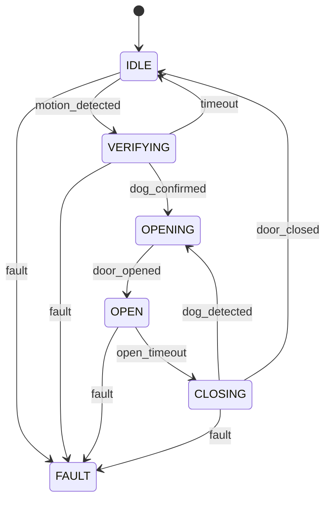

### Main Control Logic

```mermaid

stateDiagram-v2
    [*] --> IDLE

    IDLE --> VERIFYING : motion_detected
    VERIFYING --> OPENING : dog_confirmed
    VERIFYING --> IDLE : timeout

    OPENING --> OPEN : door_opened
    OPEN --> CLOSING : open_timeout

    CLOSING --> OPENING : dog_detected
    CLOSING --> IDLE : door_closed

    IDLE --> FAULT : fault
    VERIFYING --> FAULT : fault
    OPEN --> FAULT : fault
    CLOSING --> FAULT : fault

```