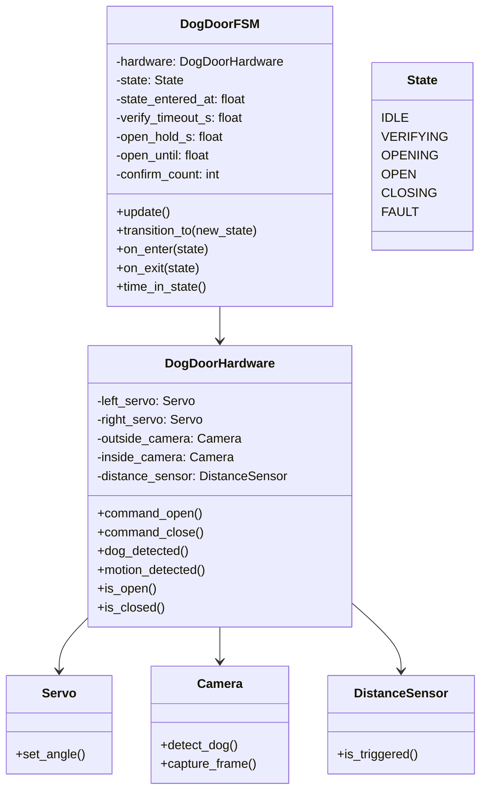

### System Overview 

```mermaid


classDiagram
    class DogDoorFSM {
        -hardware: DogDoorHardware
        -state: State
        -state_entered_at: float
        -verify_timeout_s: float
        -open_hold_s: float
        -open_until: float
        -confirm_count: int

        +update()
        +transition_to(new_state)
        +on_enter(state)
        +on_exit(state)
        +time_in_state()
    }

    class DogDoorHardware {
        -left_servo: Servo
        -right_servo: Servo
        -outside_camera: Camera
        -inside_camera: Camera
        -distance_sensor: DistanceSensor

        +command_open()
        +command_close()
        +dog_detected()
        +motion_detected()
        +is_open()
        +is_closed()
    }

    class Servo {
        +set_angle()
    }

    class Camera {
        +detect_dog()
        +capture_frame()
    }

    class DistanceSensor {
        +is_triggered()
    }

    class State {
        IDLE
        VERIFYING
        OPENING
        OPEN
        CLOSING
        FAULT
    }

    DogDoorFSM --> DogDoorHardware
    DogDoorHardware --> Servo
    DogDoorHardware --> Camera
    DogDoorHardware --> DistanceSensor


```